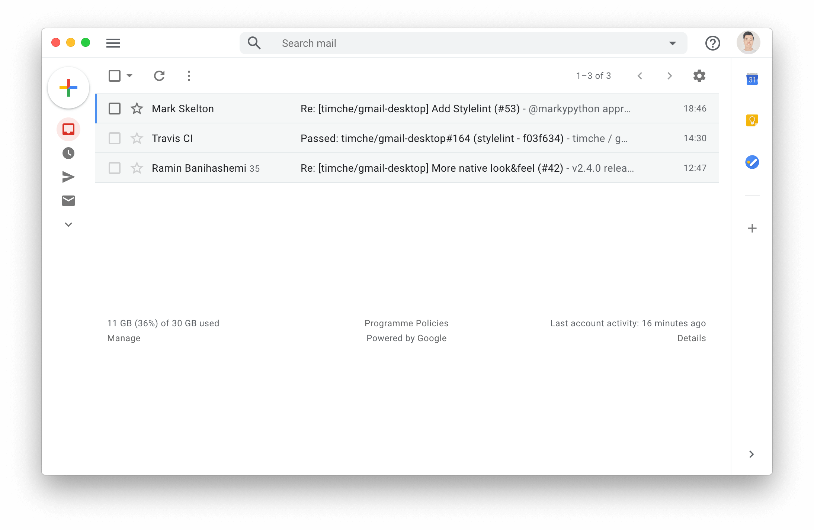

# Gmail

Gmail desktop app made for Linux, and Windows.

This app was built using [Electron](https://github.com/electron/electron).

This repo is just a private fork of [this another repo](https://github.com/timche/gmail-desktop).

# Features

- Untouched Gmail UI/UX
- Works on both Windows, and Linux (with dedicated packages for most distros).
- Native push notifications for new email. 
- Unread badge in Windows/Linux tray.
- Useful keyboard shortcuts and nifty Tray icon indicator.
- Always up-to-date underlying technologies and dependencies.

# Download

## Linux

For distros using APT (Debian and Ubuntu +/ derivatives): get the `.deb` package from [releases page](https://github.com/cyfrost/gmail-electron/releases/latest).

For DNF based distros (Fedora, RHEL, CentOS, SuSE): get the `.rpm` package from [releases page](https://github.com/cyfrost/gmail-electron/releases/latest).

`.AppImage` for everyone else.

## Windows

For Windows 7 and above, get the latest `.exe` file from [releases page](https://github.com/cyfrost/gmail-electron/releases/latest) and install it normally.

# Build Instructions

The build process is very simple:

1. Clone the repo using `$ git clone https://github.com/cyfrost/gmail-electron`.

2. Install project dependencies by running `$ make env` in project root directory.

3.  Now, to run the app, you can do `$ make run` in the project root directory (or `$ npm run start`).

## Building Distribution Packages

After making your changes, you can simply use any of the below commands to build 64-bit distribution packages.

1. Run `$ make build-rpm` to build `.rpm` packages (for Fedora/CentOS/RHEL/SuSE).
2. Run `$ make build-deb` to build `.deb` packages (for Debian/Ubuntu and derivatives).
3. Run `$ make build-pacman` to build `.pacman` packages (for Arch/Manjaro and derivatives).
4. Run `$ make build-appimage` to build `.AppImage` package (for almost every distro out there).
5. Run `$ make build-win` to build Windows `.exe` files.
6. Run `$ make build-linux` to build both `.DEB` and `.RPM` packages.
7. Run `$ make build-all` to build packages for both Windows and Linux (basically all the above).

# Contributing

No rules for contributing, Just send a PR :)

# Maintainer

- [Cyrus Frost](https://github.com/cyfrost)

# License

MIT license. Copyright © 2019 Tim Cheung

# Disclaimer

Gmail Desktop is a community-built open-source app that relies on open-source technologies and is in no way affiliated/endorsed by Google.
